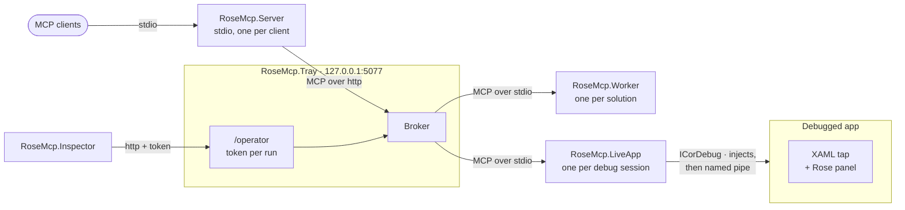

# RoseMCP

An MCP server that gives coding agents real Roslyn semantics over a loaded C# solution:
diagnostics, navigation, source-generated code, and refactorings.

Agents are good at C# right up until the question needs a compiler. Then they fall back to grep,
which matches comments and strings, misses overrides and interface implementations, and cannot see
source-generated code at all. RoseMCP puts a live, warm Roslyn compilation behind a handful of MCP
tools so the agent can ask the compiler instead of guessing.

## Why another one

Three failures are common to the Roslyn MCP servers I tried, and each is a design decision here
rather than a bug fix.

- **Stale answers.** Every read is ordered behind every pending mutation and behind a
  disk-reconciliation barrier, so a result can never describe a world older than the files on disk.
  There is no refresh step to forget.
- **Source generators silently producing nothing.** Generators arrive exactly as the real compiler
  sees them, and a load that cannot manage that is reported as degraded with the `dotnet build` that
  would fix it, instead of returning an empty list and no error.
- **Reloading the solution on every operation.** One warm worker process per solution. The first
  call pays the load; every call after it is fast.

The mechanism behind each is on the
[wiki](https://github.com/AtomicBlom/RoseMCP/wiki/Why-another-one).

## Install

On Windows, take `rosemcp-win.zip` from a release, unzip it anywhere, and run the `install.ps1`
inside it:

```powershell
./install.ps1                    # into %LOCALAPPDATA%\BinaryVibrance\RoseMCP, and start the tray
./install.ps1 -StartWithWindows  # and have the tray start at sign-in
./install.ps1 -Uninstall         # remove it; add -Purge to drop settings and logs too
```

One archive covers x64 and ARM64: it reads the machine and lays down only what that machine can
execute, so there is nothing to choose when downloading. It installs over a running instance, keeps
`settings.json` and `Logs/`, and adds an Add/Remove Programs entry.

Then register the endpoint with your agent -- the tray shows this command too:

```
claude mcp add --transport http rose http://127.0.0.1:5077
```

Or run the broker over stdio and skip the tray entirely, which is what a Linux install does:

```
claude mcp add rose -- <path>/RoseMcp.Server.exe
```

That is the whole setup. There is no `workspace_open` to call first -- every tool resolves its own
solution from a supplied path or from the working directory.

The machine needs the .NET **SDK**, not only the runtime. The worker runs a design-time build
through `Microsoft.CodeAnalysis.Workspaces.MSBuild`, which locates MSBuild and the targets out of
an SDK installation -- so with the runtime alone every project loads with no references and
reports thousands of errors about `System.Object` being undefined. True on Windows too; it is
only surprising on a server, where installing the runtime is the usual thing to do.

Windows gets the tray and the `rose_debug_*` live-app surface as well. Linux gets the stdio
broker and worker: the tray is WinUI and the debugger is ICorDebug, so neither has a Linux build
to ship, and the tools that would have nothing behind them are not advertised there.

To make an agent actually reach for it, add this to the consuming repository's `CLAUDE.md`:

```markdown
## C# navigation and refactoring

Use the Roslyn-backed `rose_*` MCP tools rather than grep or find-and-replace for C# in this
repo: `rose_find_references` for usages, `rose_outline` for what a type contains, and
`rose_add_member` / `rose_replace_member` / `rose_replace_body` to change one, since those
format what they write and report what the edit broke. `rose_diagnostics` says whether it
compiles. Source-generated code is only readable via `rose_list_generated_documents` /
`rose_read_generated_document`.
```

A longer version, covering the whole writing surface, is
[on the wiki](https://github.com/AtomicBlom/RoseMCP/wiki/Using-Rose-in-your-own-repository).

## What it does

Fifty-one tools in six families. Every one addresses code by name rather than by line and column, so
nothing needs a grep first and nothing goes stale when an earlier edit moves a line.

**Reading and navigation**, 8 tools. `rose_outline` for what a type or a file contains,
`rose_symbol_info` for one member and its source, `rose_find_references` for usages grouped by the
member each sits inside, `rose_find_implementations` for the other direction, `rose_search_symbols`,
`rose_project_graph`, and the two generated-document tools, which are the only way to read
source-generated code at all.

**Writing C#**, 13 tools. `rose_add_file` starts a file in the right project, with the namespace its
folder implies and the imports its code needs. `rose_add_member`, `rose_replace_member`,
`rose_delete_member` and `rose_replace_body` change a member. `rose_change_signature` adds, removes
or retypes a parameter across every override, implementation and call site at once, and
`rose_rename_symbol`, `rose_move_member` and `rose_move_type_to_file` move things about. All of them
refuse code that does not parse, format what they write, work out the imports, and report what the
edit broke, so there is no build in the edit loop.

**Diagnostics, fixes and formatting**, 5 tools. `rose_diagnostics` from a warm compilation in
milliseconds, `rose_list_code_fixes` and `rose_apply_code_fix` through the analyzers the solution
already carries, `rose_format` against its own `.editorconfig`, and `rose_build_freshness` for
whether what is sitting in `bin` is this code. No dependency was added for any of it:
[where the fixers come from](https://github.com/AtomicBlom/RoseMCP/wiki/Code-fixes), and
[why formatting takes two passes](https://github.com/AtomicBlom/RoseMCP/wiki/Formatting).

**Workspace**, 4 tools. Load state, per-project health, degraded-load detection and the MSBuild
properties in use. `rose_workspace_open` returns at once, so a session can do something else while a
large solution opens.

**Live app debugging**, 15 tools, Windows only. Attach to or launch a .NET process, including a
packaged UWP app, then breakpoints, tracepoints, stepping, frames, variables, threads and expression
evaluation.

**Live XAML**, 6 tools, Windows only. The running app's visual tree, every element's properties and
what set each one, click-to-select from inside the app itself, and edits applied to the live element
objects.

Every result carries a `revision`, so a caller can tell whether two answers describe the same world.

## How it works

With a tray running, every stdio session relays to it, and the tray owns the workers, the debug
sessions and the operator API the inspector reads:



With no tray, the same stdio server runs that broker itself, owning its workers and debug sessions
for as long as its client is connected, and there is no inspector to open. Both arrangements and a
live-app request followed end to end are on
[the wiki](https://github.com/AtomicBlom/RoseMCP/wiki/Architecture).

The broker owns tool schemas and routing and never references Roslyn, so it stays responsive while
a worker grinds through a design-time build. Workers are started on demand, one per solution, and
kept warm.

They are separate processes for a reason: analyzer and generator assemblies cannot be unloaded
once loaded, MSBuild resolution is per-process, and killing a worker is the only reliable way to
reclaim memory or pick up a generator you just rebuilt. Workers exit when their stdin closes, so
they die with the broker and never orphan.

### XAML projects

WPF, UWP and WinUI code-behind is only half a class: the base type, the `x:Name` fields and
`InitializeComponent` come from a partial the markup compiler generates, and that compiler does not
run in a design-time build. So the markup is parsed and that partial is synthesised instead. On a
50-project UWP app that took one project from 2030 errors that were not real down to 19 that were,
and all 450 synthesised classes agreed with the files a real build leaves in `obj`.

Which flavour of XAML a project is written in is decided from what it references, and how much of a
stub each framework needs differs.
[Details](https://github.com/AtomicBlom/RoseMCP/wiki/XAML-projects).

### Configurations and platforms

A design-time build is a build, so it obeys MSBuild properties. A solution that declares neither
`Debug` nor `AnyCPU`, loaded as `Debug|AnyCPU`, gives projects with no target framework and no
references at all, and the thousands of diagnostics that follow name everything except the cause. So
the configuration is chosen rather than assumed, and `rose_workspace_status` reports the choice, the
alternatives and the reason.

A solution whose answer is always the same can commit it, in a `rosemcp.json` beside the solution:

```json
{
  "configuration": "Debug-2027",
  "platform": "x64",
  "properties": { "RevitVersion": "2027" }
}
```

[How the choice is made](https://github.com/AtomicBlom/RoseMCP/wiki/Configurations-and-platforms).

### Transports

```
RoseMcp.Server.exe                                   # stdio (default)
RoseMcp.Server.exe --transport http --port 5077      # http + GET /admin/workspaces
RoseMcp.Tray.exe                                     # tray UI, hosts the broker in-process
```

HTTP mode outlives any one client session, so a reconnecting agent reattaches to solutions that are
already warm. It binds `127.0.0.1` by default and refuses a non-loopback bind unless `ROSEMCP_TOKEN`
is set, because this server reads and rewrites source anywhere it can reach.

Register it as stdio and the two stop being alternatives. With a tray already running, a stdio server
starts no workers of its own and relays to the tray, which owns them, so every session shares one
warm worker per solution and still resolves a bare call against its own working directory.
[Why that is the arrangement worth having](https://github.com/AtomicBlom/RoseMCP/wiki/Transports-and-the-tray),
and what the tray window shows.

### Debugging and XAML

A debug session can be driven three ways at once, and all three see the same session:

- **Agents**, through the `rose_debug_*` and `rose_xaml_*` tools.
- **The Rose panel**, a toolbar RoseMCP puts inside a running UWP or WinUI 3 app. Pick an element for
  the agent to work on, show its margins and padding and measure gaps, or magnify the app or its
  pixels.
  [Details and screenshots](https://github.com/AtomicBlom/RoseMCP/wiki/The-Rose-panel).
- **The inspector**, `RoseMcp.Inspector.exe`, a window beside the app with the event tail,
  breakpoints and tracepoints, the call stack with its source and values, threads, and the live visual
  tree. It reads the session from the tray over a token-protected http API, so it can be closed and
  reopened while the session carries on, and it shows sessions an agent started. Open it with
  **Inspect** on a session in the tray.
  [Details and screenshots](https://github.com/AtomicBlom/RoseMCP/wiki/The-inspector).

## Building from source

Requires the .NET 10 SDK.

```
dotnet build RoseMcp.slnx
dotnet test
dotnet format --verify-no-changes
```

Run a worker standalone against a fixture -- the fastest way to see Roslyn behaviour without the
broker in the way:

```
dotnet run --project src/RoseMcp.Worker -- --solution tests/fixtures/WithGenerator/WithGenerator.slnx
```

Changing the code rather than using it: [`CLAUDE.md`](CLAUDE.md) has the rules that bind everywhere,
[`docs/invariants/`](docs/invariants) the rules for each subsystem with the failure each prevents,
[`docs/decisions/`](docs/decisions) one record per design decision, and [`docs/debug/`](docs/debug)
the live-app debugging surface and its security model.

### Dogfooding

Work on this repository with this server running against it, registered globally rather than per
project:

```
claude mcp add rose -s user -- <path>/RoseMcp.Server.exe
```

There is deliberately no `.mcp.json` here. Committing one would either pin every contributor to one
machine's install path or point at a build output that may not exist yet; a user-scope registration
covers this repository along with every other.

This is not ceremony.
[Two of the sharper bugs in this codebase](https://github.com/AtomicBlom/RoseMCP/wiki/Dogfooding)
were found by using it on itself and not by its tests.

## Status

Early, and used daily against its own repository. The tool surface above is stable. Live-app
debugging and XAML inspection are Windows only, and newer than the rest.
